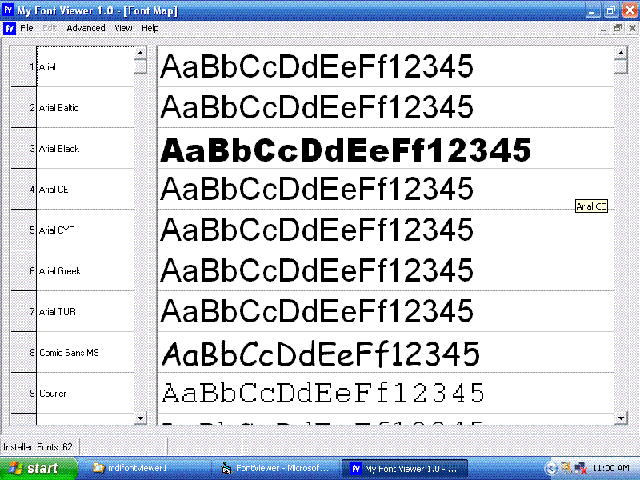



## my font viewer 1\.0

### Description

preview all the installed/not installed fonts.

compare fonts, see the character map.
 
### More Info
 
uses msflexgrid control,

vb6 prof

             |
---                |---
**Submitted On**   |2004-10-06 13:52:24
**By**             |[alexkcherian](https://github.com/Planet-Source-Code/PSCIndex/blob/master/ByAuthor/alexkcherian.md)
**Level**          |Intermediate
**User Rating**    |4.0 (16 globes from 4 users)
**Compatibility**  |VB 6\.0
**Category**       |[Complete Applications](https://github.com/Planet-Source-Code/PSCIndex/blob/master/ByCategory/complete-applications__1-27.md)
**World**          |[Visual Basic](https://github.com/Planet-Source-Code/PSCIndex/blob/master/ByWorld/visual-basic.md)
**Archive File**   |[my\_font\_vi2056413272007\.zip](https://github.com/Planet-Source-Code/alexkcherian-my-font-viewer-1-0__1-68226/archive/master.zip)

